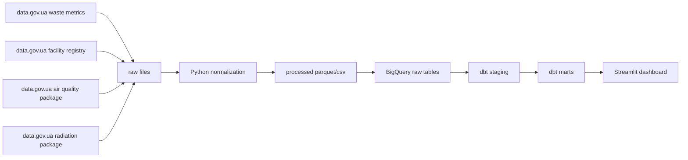

# K-EcoLOGIC Lab

K-EcoLOGIC Lab is a research-oriented environmental data platform under the broader K-RnD Lab direction.

The first delivery in this repository is:

`SortSmart Ukraine`

It is a nationwide data engineering module about waste sorting readiness, recovery potential, and modeled climate impact across Ukraine.

The project answers a practical question:

How much municipal waste is generated across Ukrainian regions, how much is still diverted to landfills, where the waste-management infrastructure already exists, and what potential climate benefit Ukraine could unlock by scaling smarter sorting and recovery?

## Brand Positioning

Recommended interpretation of the name:

- `K-EcoLOGIC Lab`
- `Eco` for ecology and environmental systems
- `LOGIC` for evidence, structure, modeling, and decision support

This makes the brand feel more like a serious analytical lab than a generic "green awareness" page.

For the Zoomcamp project, use the brand plus a descriptive subtitle:

- `K-EcoLOGIC Lab: SortSmart Ukraine`
- optional long title:
  - `K-EcoLOGIC Lab: Nationwide Waste Sorting Readiness and Climate Impact Dashboard for Ukraine`

## Why this is interesting

Many climate dashboards stop at awareness. This one is meant to support action:

- show the current waste picture by region
- estimate the gap between generated waste and recovered waste
- connect waste sorting with material-science style categories
- translate recovery potential into modeled avoided CO2e
- leave room for a future citizen-facing assistant such as "where should this item go?"

## Platform Vision

K-EcoLOGIC Lab is designed as a modular environmental intelligence platform for Ukraine.

Target platform modules:

- `SortSmart Ukraine`
  - waste sorting readiness
  - recovery gap
  - circular materials intelligence
- `Air & Exposure`
  - PM2.5 / AQI / urban exposure context
- `Water Watch`
  - surface-water monitoring and quality trends
- `Polluters & Permits`
  - permits, EIA, and industrial monitoring context
- `Radiation & Risk`
  - radiation context and anomaly monitoring

This repository focuses on the first module because it is the strongest wedge for a working nationwide MVP and the safest path for Zoomcamp validation.

## Project Scope

This repo is intentionally scoped as a nationwide MVP for the Zoomcamp deadline:

- official nationwide waste-generation metrics by region and year
- official national registry of waste-management facilities
- official air-quality package metadata and latest monthly files as climate context
- a modeled material-recovery layer based on transparent assumptions
- a Streamlit dashboard for storytelling and peer review

This is not a real-time nationwide waste counter. It is a transparent analytical model built on open public datasets plus explicit assumptions.

## Data Sources

Primary sources currently wired into the pipeline:

- `data.gov.ua` resource `186-obroblennia-vidkhodiv-po-regionakh.xlsx`
  - scope: waste management outcomes by region/year
  - format: XLSX
  - resource id: `f50ed162-ec41-4fad-9091-ff8f603e1f45`
- `data.gov.ua` resource `Reestr_OUV_01-01-2023.ods`
  - scope: registry of waste-generation / treatment / utilization objects
  - format: ODS
  - resource id: `a6d9eac6-f82e-4a76-a014-ca8b00aa74c4`
- `data.gov.ua` package `0e9e5b53-e94a-467f-a868-c245a9662b38`
  - scope: monthly air-quality observations in populated places
  - format: XLS/XLSX per month
- `data.gov.ua` package `surface-water-monitoring`
  - scope: state monitoring of surface waters
  - format: CSV
  - current pipeline uses the latest monthly CSV resource
- `data.gov.ua` dataset `110ba5fd-42e3-43f8-80f3-e640514c1c76`
  - scope: open permits list for pollutant emissions
  - format: CSV
  - current pipeline uses the latest published CSV resource
- `data.gov.ua` dataset `80c116f5-9826-4e8e-87f8-ff5d5342da94`
  - scope: nationwide radiation-monitoring stations and indicator dictionary collected by SaveEcoBot / SaveDnipro
  - format: CSV
  - current MVP uses station coverage and indicator metadata, not the full historical measurements archive
- material factors are stored locally in `dbt/seeds/material_factors.csv`
  - purpose: transparent modeling assumptions for recyclable share and avoided CO2e
  - note: these are scenario inputs, not an official Ukrainian state dataset

## Architecture



## Platform Surface

The public-facing interface is intentionally structured as one site with multiple modules.

Current module layout:

- `Home`
  - platform overview and module map
- `SortSmart Ukraine`
  - live nationwide waste-sorting dashboard
- `Air & Exposure`
  - live MVP climate-context page
- `Water Watch`
  - live MVP basin-level monitoring page
- `Polluters & Permits`
  - live MVP permits page
- `Radiation & Risk`
  - live MVP radiation-network coverage page

This keeps the project submission coherent as one environmental platform while allowing the first module to be fully operational today.

## Local Setup

On Windows, use the PowerShell helper:

```powershell
Set-ExecutionPolicy -Scope Process Bypass
.\run_local.ps1
```

Or run the steps manually:

```powershell
py -m venv .venv
.\.venv\Scripts\Activate.ps1
pip install -r requirements.txt
$env:PYTHONPATH = "src"
python -m sortsmart_ukraine.pipeline.run_local
streamlit run dashboard/app.py
```

## Hosting

For a straightforward public demo, deploy the Streamlit app from this subproject to Streamlit Community Cloud.

Recommended app entrypoint:

- `S6 — 🌍 Ecology & Environmental Science/S6-A - K-EcoLOGIC Lab/app.py`

The lab root now acts as the canonical public platform entrypoint, while the internal `R1a` dashboard files continue to supply the module pages.

The repository now also carries a processed snapshot under `data/processed`, which makes the hosted app immediately viewable without running the full pipeline on every cold start.

## Submission Notes

Recommended project framing for Zoomcamp:

- project title: `K-EcoLOGIC Lab: SortSmart Ukraine`
- problem statement:
  - Ukraine has a persistent municipal waste problem, low sorting habits, and limited visible infrastructure for separate collection. This project builds a nationwide analytical pipeline that combines official waste statistics, official infrastructure registry data, and explicit material-recovery assumptions to estimate regional sorting readiness, landfill dependence, recovery gaps, and modeled avoided CO2e.

## Known Limitations

- the climate-impact layer is modeled, not directly measured
- the air-quality component is currently a context layer, not the main decision engine
- the current regional waste file exposes waste-management outcomes, so `generated` is proxied from recovery + incineration + landfill-disposal for scoring
- the current permits MVP is based on the latest open CSV resource available for Vinnytsia oblast, so this module is a regional pilot rather than nationwide coverage
- the radiation MVP currently shows monitoring-network coverage and source context, not a validated real-time emergency warning feed
- facility registry parsing may need one light iteration after the first real run depending on schema drift
