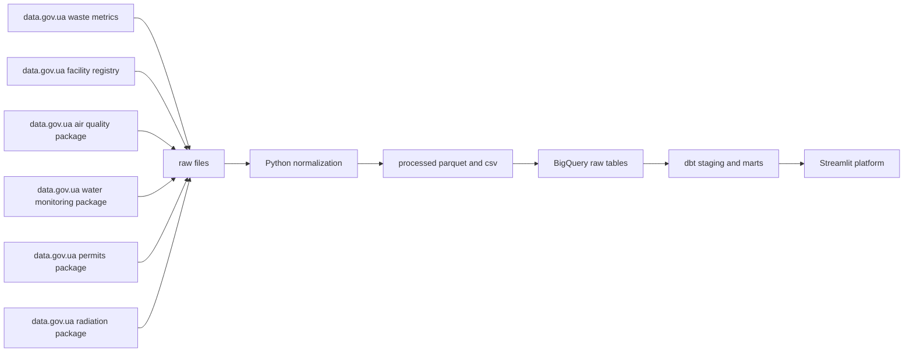

# K-EcoLOGIC Lab

K-EcoLOGIC Lab is a research-oriented environmental data platform under the broader K-RnD Lab direction.

The flagship delivery in this repository is:

`SortSmart Ukraine`

It is a nationwide data engineering module about waste sorting readiness, recovery potential, and modeled climate impact across Ukraine.

## Live Demo

- public app
  - `https://k-ecologic-lab.streamlit.app/`
- deploy entrypoint
  - `deploy/k_ecologic_lab.py`

## Project Question

This project answers a practical question:

How much municipal waste is generated across Ukrainian regions, how much is still diverted to landfills, where the waste-management infrastructure already exists, and what potential climate benefit Ukraine could unlock by scaling smarter sorting and recovery?

## Brand Positioning

Recommended interpretation of the name:

- `K-EcoLOGIC Lab`
- `Eco` for ecology and environmental systems
- `LOGIC` for evidence, structure, modeling, and decision support

For the Zoomcamp project, use the brand plus a descriptive subtitle:

- `K-EcoLOGIC Lab: SortSmart Ukraine`
- optional long title
  - `K-EcoLOGIC Lab: Nationwide Waste Sorting Readiness and Climate Impact Dashboard for Ukraine`

## Why this is interesting

Many climate dashboards stop at awareness. This one is meant to support action:

- show the current waste picture by region
- estimate the gap between generated waste and recovered waste
- connect waste sorting with material-science style categories
- translate recovery potential into modeled avoided CO2e
- extend into air, water, permits, and radiation as one environmental platform

## Platform Vision

K-EcoLOGIC Lab is designed as a modular environmental intelligence platform for Ukraine.

Current modules:

- `SortSmart Ukraine`
  - waste sorting readiness
  - recovery gap
  - circular materials intelligence
- `Air & Exposure`
  - air-quality context and urban exposure visibility
- `Water Watch`
  - surface-water monitoring and basin summaries
- `Polluters & Permits`
  - permits, EIA, and oversight context
- `Radiation & Risk`
  - radiation context and network coverage

## Project Scope

This repo is intentionally scoped as a nationwide MVP for the Zoomcamp deadline:

- official nationwide waste-generation metrics by region and year
- official national registry of waste-management facilities
- official air-quality package metadata and latest monthly files as climate context
- official surface-water monitoring package
- official permits registry source
- official radiation-monitoring station and indicator package
- a modeled material-recovery layer based on transparent assumptions
- a Streamlit platform for storytelling and peer review

This is not a real-time nationwide waste counter. It is a transparent analytical model built on open public datasets plus explicit assumptions.

## Delivery Footprint

This submission is packaged as one coherent platform, but its delivery can also be read as a set of concrete proof-of-capability layers:

- domain framing
  - a clearly stated Ukraine-focused waste, recovery, and environmental-intelligence problem
- cloud-backed data layer
  - BigQuery is used as the warehouse target for the cloud run path
- ingestion
  - Python fetches and normalizes official waste, facilities, air, water, permits, and radiation datasets
- warehouse
  - normalized datasets and analytical outputs are loaded into BigQuery
- transformations
  - `dbt` adds a seed plus staging and mart models over the warehouse layer
- dashboard
  - one Streamlit platform exposes the flagship waste module plus supporting environmental MVP modules
- reproducibility
  - PowerShell launchers, a GCP setup helper, pinned dependencies, and a processed snapshot are included so the project is reviewable without rebuilding everything from scratch

## Data Sources

Primary sources currently wired into the pipeline:

- `data.gov.ua` resource `186-obroblennia-vidkhodiv-po-regionakh.xlsx`
  - scope: waste management outcomes by region and year
  - resource id: `f50ed162-ec41-4fad-9091-ff8f603e1f45`
- `data.gov.ua` resource `Reestr_OUV_01-01-2023.ods`
  - scope: registry of waste-generation, treatment, and utilization objects
  - resource id: `a6d9eac6-f82e-4a76-a014-ca8b00aa74c4`
- `data.gov.ua` package `0e9e5b53-e94a-467f-a868-c245a9662b38`
  - scope: monthly air-quality observations in populated places
- `data.gov.ua` package `surface-water-monitoring`
  - scope: state monitoring of surface waters
- `data.gov.ua` dataset `110ba5fd-42e3-43f8-80f3-e640514c1c76`
  - scope: open permits list for pollutant emissions
- `data.gov.ua` dataset `80c116f5-9826-4e8e-87f8-ff5d5342da94`
  - scope: nationwide radiation-monitoring stations and indicator dictionary collected by SaveEcoBot / SaveDnipro
- local `dbt/seeds/material_factors.csv`
  - purpose: transparent modeling assumptions for recyclable share and avoided CO2e

## Architecture



## BigQuery Usage

Yes, BigQuery is part of the implemented project and not just a planned option.

The cloud setup uses:

- project id
  - currently validated on `k-rnd-lab`
- dataset
  - `sortsmart_raw`
- location
  - `EU` by default

The Python warehouse loader pushes these data assets into BigQuery:

- normalized and base tables
  - `waste_metrics`
  - `waste_facilities`
  - `waste_facility_counts`
  - `air_quality_context`
  - `water_monitoring_observations`
  - `permits_registry`
  - `radiation_locations`
  - `radiation_indicators`
- analytical outputs prepared in Python
  - `oblast_sorting_readiness`
  - `oblast_sorting_readiness_trend`
  - `air_module_overview`
  - `water_basin_overview`
  - `permits_city_overview`
  - `radiation_station_overview`
  - `radiation_platform_overview`

On top of that, `dbt` is used in the same warehouse to validate an additional transformation layer:

- seed table
  - `material_factors`
- staging views
  - `stg_waste_metrics`
  - `stg_waste_facility_counts`
- mart table
  - `mart_oblast_sorting_readiness`

So the project uses both:

- local Parquet outputs for fast local iteration and deployment snapshots
- BigQuery for the cloud warehouse path and `dbt` validation flow

## Platform Surface

The public-facing interface is intentionally structured as one site with multiple modules.

Current module layout:

- `Home`
  - platform overview and module map
- `SortSmart Ukraine`
  - live nationwide waste-sorting dashboard
- `Air & Exposure`
  - live MVP climate-context page
- `Water Watch`
  - live MVP basin-level monitoring page
- `Polluters & Permits`
  - live MVP permits page
- `Radiation & Risk`
  - live MVP radiation-network coverage page

This keeps the project submission coherent as one environmental platform while allowing the first module to be the deepest operational layer today.

## Local Setup

On Windows, use the PowerShell helper:

```powershell
Set-ExecutionPolicy -Scope Process Bypass
.\run_local.ps1
```

For the full platform shell:

```powershell
Set-ExecutionPolicy -Scope Process Bypass
..\..\run_lab.ps1
```

## Hosting

For a straightforward public demo, deploy the Streamlit app from the repository-level deploy wrapper to Streamlit Community Cloud.

Recommended app entrypoint:

- `deploy/k_ecologic_lab.py`

The lab root remains the canonical platform app, while the repository-level deploy wrapper keeps hosted deployment stable and ASCII-safe.

The repository now also carries a processed snapshot under `data/processed`, which makes the hosted app immediately viewable without running the full pipeline on every cold start.

## Sandbox Retention Note

If you keep the project on BigQuery Sandbox with billing disabled, the platform code and local files stay safe, but warehouse objects in BigQuery do not stay there forever.

In practice for this project, the items that automatically expire are the BigQuery objects inside the sandbox dataset, including:

- tables
  - for example `waste_metrics`, `permits_registry`, `oblast_sorting_readiness`, `air_module_overview`
- views
  - for example `stg_waste_metrics`, `stg_waste_facility_counts`
- partitions
  - if partitioned relations are added later

The items that do not disappear just because Sandbox expiration is reached are:

- the GitHub repository
- the Streamlit app code
- local `data/processed` snapshot files in the repo
- your local JSON key file
- the GCP project itself
- the BigQuery dataset container name

If a sandbox table expires, the practical recovery path for this project is simply to rerun:

- `.\setup_bigquery.ps1 ...`

That recreates the dataset contents and reruns the `dbt` layer.

## Submission Notes

Recommended project framing for Zoomcamp:

- project title
  - `K-EcoLOGIC Lab: SortSmart Ukraine`
- GitHub path
  - `S6 — 🌍 Ecology & Environmental Science/S6-A - K-EcoLOGIC Lab`
- live app
  - `https://k-ecologic-lab.streamlit.app/`

## Known Limitations

- the climate-impact layer is modeled, not directly measured
- the air-quality component is currently a context layer, not the main decision engine
- the current regional waste file exposes waste-management outcomes, so `generated` is proxied from recovery, incineration, and landfill-disposal for scoring
- the current permits MVP is based on the latest open CSV resource available for Vinnytsia oblast, so this module is a regional pilot rather than nationwide coverage
- the radiation MVP currently shows monitoring-network coverage and source context, not a validated real-time emergency warning feed
